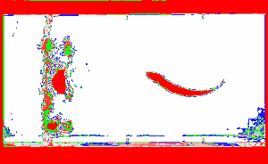

```{=html}
<section class="article-section">
  <div class="ad-page-container">
    <article class="main-article">
      <div class="article-content">
        <aside class="status-banner status-banner--exploratory">
          <p class="status-banner__title">Status: <a href="how-to-read.html#publication-states" class="status-badge status-badge--experimental" title="Experimental — Click to Read Publication State Definition"><svg class="status-badge__icon" aria-hidden="true" width="13" height="13" viewBox="0 0 24 24" fill="none" stroke="currentColor" stroke-width="2.2" stroke-linecap="round" stroke-linejoin="round"><path d="M10 2v7.31L4.1 19.34A2 2 0 0 0 5.8 22h12.4a2 2 0 0 0 1.7-2.66L14 9.31V2"></path><path d="M8.5 2h7"></path><path d="M7 16h10"></path></svg><span class="status-badge__text">Experimental</span></a> (Expected: 2026-Q4)</p>
          <p class="status-banner__body">
            A curated collection of exploratory physics and biology demonstrations. Currently one initial entry;
            additional examples are planned for development.
          </p>
          <p class="status-banner__body">
            Have an interesting topic? Submit ideas to <a href="collaborate.html">Collaborate</a>.
          </p>
        </aside>

        <section class="article-body">
          <div class="page-section u-mb-3">
            <h1 class="section-heading">Daydreams &amp; Doodles</h1>
            <p class="page-subtitle">Exploratory physical models and demonstrations in biomechanics, fluid dynamics, and passive dynamics</p>
          </div>

          <div class="resource-grid u-mt-4">
            <div class="resource-card resource-card--full">
              <div class="resource-header">
                <span class="resource-type">Research</span>
                <h2>Dead Fish Swimming Upstream</h2>
              </div>
              <figure class="figure-block">
                <picture>
                  <source media="(prefers-reduced-motion: reduce)" srcset="../static/images/A-Dead-Fish-Swims-poster.webp" type="image/webp">
                  <source srcset="../static/images/A-Dead-Fish-Swims.webp" type="image/webp">
                  
                </picture>
              </figure>
              <p class="resource-description">
                This demonstration shows a dead fish propelled upstream through vortex-induced oscillation.
                The phenomenon illustrates how passive body geometry can interact with structured fluid flow to produce
                net propulsive forces without active muscular input. Beal et al. (2006) demonstrated that compliant bodies
                placed in the K&aacute;rm&aacute;n vortex street behind a cylinder can extract energy from the flow and move upstream,
                a result consistent with earlier observations by Liao et al. (2003) showing that live trout reduce muscle
                activity when exploiting vortex wakes.
              </p>
              <p class="resource-footnote">
                <strong>Primary sources:</strong>
                <a href="https://doi.org/10.1017/S0022112005007925">Beal et al. (2006), <em>Passive propulsion in vortex wakes</em></a>;
                <a href="https://doi.org/10.1126/science.1088295">Liao et al. (2003), <em>Fish exploiting vortices decrease muscle activity</em></a>.
              </p>
              <p class="resource-footnote resource-footnote--italic">
                The comparison with mechanical drift is an editorial analogy, not evidence that the two systems
                share a causal mechanism. Fluid-structure interaction, a prescribed wake, and a compliant fish body
                are materially different from a declared multibody golf model.
              </p>
            </div>

          </div>
        </section>
      </div>
    </article>
  </div>
</section>
```

## Related Articles

- [Passive Distributed Control](../articles/passive-distributed-control.html) — How passive mechanics can shape motion without active input
- [Drifter Manifesto](drifter-manifesto.html) — The control-affine framework for understanding passive dynamics
- [Collaborate](collaborate.html) — Submit ideas for exploratory topics
