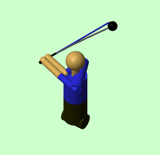

```{=html}
<section class="resources-section">
  <div class="container">
    <div class="resources-layout">
      <!-- Left Sidebar Navigation -->
      <aside class="resources-sidebar">
        <nav class="resources-nav">
          <h3 class="resources-nav-heading">Resources</h3>
          <ul class="resources-nav-links">
            <li><a href="resources.html">Resources Home</a></li>
            <li><a href="resources-videos.html">Videos</a></li>
            <li><a href="resources-software.html">Software</a></li>
            <li><a href="resources-websites.html" class="active">Websites</a></li>
            <li><a href="resources-datasets.html">Datasets</a></li>
            <li><a href="resources-books.html">Books</a></li>
            <li><a href="resources-papers.html">Papers</a></li>
            <li><a href="resources-researchers.html">Researchers</a></li>
          </ul>
        </nav>
      </aside>

      <!-- Main Content -->
      <main class="resources-main">
        <div class="page-header">
          <h1>Websites</h1>
          <p class="page-subtitle">Educational websites and online resources on robotics, biomechanics, screw theory, and golf</p>
        </div>
    <div class="resource-grid">
      <div class="resource-card has-media">
        <div class="resource-media">
          <a href="https://royfeatherstone.org/" target="_blank" rel="noopener">
            
          </a>
        </div>
        <div class="resource-content">
        <h3>Roy Featherstone's Website</h3>
        <p class="resource-description">
          Roy Featherstone is a prominent researcher in robotics and rigid-body dynamics. His website 
          offers comprehensive tutorials on spatial (6D) vectors and provides software tools for calculating 
          robot and rigid-body dynamics. Notably, it features the spatial_v2 software library, which 
          complements his authoritative book "Rigid Body Dynamics Algorithms." The site includes information 
          about his research projects, teaching materials, publications, and talks, making it an essential 
          resource for understanding multibody dynamics and robot kinematics.
        </p>
        <a href="https://royfeatherstone.org/"
           class="resource-link"
           target="_blank"
           rel="noopener">
          Visit Website →
        </a>
        </div>
      </div>

      <div class="resource-card has-media">
        <div class="resource-media">
          <a href="https://www.golfscience.org" target="_blank" rel="noopener">
            
          </a>
        </div>
        <div class="resource-content">
        <h3>GolfScience.org</h3>
        <p class="resource-description">
          GolfScience.org is a comprehensive resource for golf biomechanics research, providing access to peer-reviewed scientific papers, research summaries, and educational materials on golf swing mechanics, equipment science, and performance analysis. The site serves as a bridge between academic research and practical golf instruction, making complex biomechanical concepts accessible to coaches, researchers, and serious students of the game.
        </p>
        <a href="https://www.golfscience.org"
           class="resource-link"
           target="_blank"
           rel="noopener">
          Visit Site →
        </a>
        </div>
      </div>

      <div class="resource-card has-media">
        <div class="resource-media">
          <a href="https://www.tutelman.com/golf/swing/" target="_blank" rel="noopener">
            
          </a>
        </div>
        <div class="resource-content">
        <h3>Dave Tutelman Golf Website</h3>
        <p class="resource-description">
          Dave Tutelman's comprehensive website provides in-depth technical analysis of golf swing mechanics, equipment design, and the physics of golf. His work offers detailed mathematical treatments of club dynamics, ball flight, and swing biomechanics, making it an invaluable resource for understanding the engineering principles behind golf performance.
        </p>
        <a href="https://www.tutelman.com/golf/swing/"
           class="resource-link"
           target="_blank"
           rel="noopener">
          Visit Site →
        </a>
        </div>
      </div>

      <div class="resource-card has-media">
        <div class="resource-media">
          <a href="https://openforumgolf.com/" target="_blank" rel="noopener">
            
          </a>
        </div>
        <div class="resource-content">
          <h3>Open Forum Golf</h3>
          <p class="resource-description">
            Open Forum Golf is an online platform dedicated to golf discussion, analysis, and community engagement. The site provides a forum for golfers, instructors, and enthusiasts to share insights, discuss golf techniques, equipment, and the latest developments in the sport. It serves as a valuable resource for connecting with the golf community and accessing diverse perspectives on golf-related topics.
          </p>
          <a href="https://openforumgolf.com/"
             class="resource-link"
             target="_blank"
             rel="noopener">
            Visit Website →
          </a>
        </div>
      </div>

      <div class="resource-card has-media">
        <div class="resource-media">
          <a href="https://uwaterloo.ca/motion-research-group/projects/golf-biomechanics-and-club-optimization" target="_blank" rel="noopener">
            
          </a>
        </div>
        <div class="resource-content">
          <h3>Motion Research Group - Golf Biomechanics and Club Optimization</h3>
          <p class="resource-description">
            The Motion Research Group at the University of Waterloo conducts advanced research in golf biomechanics and club optimization. Their work includes developing multibody dynamic models of golfer biomechanics, flexible shafts, ball flight aerodynamics, and clubhead-ball contact dynamics. The group uses optimization techniques to systematically evaluate the effects of swing and equipment changes, collaborating with golf-club companies and professional regulatory agencies. Model validation is provided through optical and inertial motion capture, AboutGolf simulator, pressurized air cannon, and high-speed video camera (600,000 fps). The research focuses on sports biomechanics, club design optimization, optimal golfer biomechanics, and predictive golf simulations.
          </p>
          <a href="https://uwaterloo.ca/motion-research-group/projects/golf-biomechanics-and-club-optimization"
             class="resource-link"
             target="_blank"
             rel="noopener">
            Visit Website →
          </a>
        </div>
      </div>

      <div class="resource-card has-media">
        <div class="resource-media">
          
          <video controls class="resource-media-video" style="margin-top: 1rem;">
            <source src="content/WSCG2024/GolfSwing.mp4" type="video/mp4">
            Your browser does not support the video tag.
          </video>
        </div>
        <div class="resource-content">
        <h3>WSCG / ISEA 2024 Conference</h3>
        <p class="resource-description">
          Evaluation of the Effect of Momentum on Interaction Forces in a Linked System -
          Joint WSCG / ISEA 2024 Conference presentation and paper. The video demonstration shows the 
          dynamics and motion of the linked system, demonstrating the effect of momentum on interaction 
          forces as analyzed in the conference paper.
        </p>
        <a href="content/WSCG2024/WeT21_Evaluation of the Effect of Momentum on Interaction Forces in a Linked System.pptx"
           class="resource-link"
           download>
          Download Presentation →
        </a>
        <a href="content/WSCG2024/Dieter Olson - Evaluation of the Effect of Momentum on Interaction Forces in a Linked System - Final.pdf"
           class="resource-link"
           target="_blank"
           rel="noopener"
           style="margin-top: 0.5rem; display: inline-block;">
          View Paper →
        </a>
        </div>
      </div>

      <div class="resource-card has-media">
        <div class="resource-media">
          <a href="https://underactuated.mit.edu/" target="_blank" rel="noopener">
            
          </a>
        </div>
        <div class="resource-content">
          <h3>MIT Underactuated Robotics</h3>
          <p class="resource-description">
            The official website for MIT's course on underactuated robotics, featuring a complete open-source textbook, 
            lecture videos, homework assignments, and software tools. This comprehensive resource covers algorithms for 
            walking, running, swimming, flying, and manipulation, emphasizing the exploitation of natural dynamics. All 
            materials are freely available and provide deep insights into control of systems with fewer actuators than 
            degrees of freedom.
          </p>
          <a href="https://underactuated.mit.edu/"
             class="resource-link"
             target="_blank"
             rel="noopener">
            Visit Website →
          </a>
        </div>
      </div>

      <div class="resource-card has-media">
        <div class="resource-media">
          <a href="http://hades.mech.northwestern.edu/index.php/Modern_Robotics" target="_blank" rel="noopener">
            
          </a>
        </div>
        <div class="resource-content">
          <h3>Modern Robotics Course Wiki</h3>
          <p class="resource-description">
            Northwestern University's comprehensive course wiki for Modern Robotics, featuring lecture notes, video 
            lectures, software libraries, and interactive tools. The site provides free access to the complete textbook 
            PDF, Python and MATLAB code libraries, and extensive educational materials covering robot kinematics, dynamics, 
            motion planning, and control using modern geometric methods.
          </p>
          <a href="http://hades.mech.northwestern.edu/index.php/Modern_Robotics"
             class="resource-link"
             target="_blank"
             rel="noopener">
            Visit Website →
          </a>
        </div>
      </div>

      <div class="resource-card has-media">
        <div class="resource-media">
          <a href="https://www.cds.caltech.edu/~murray/wiki/index.php?title=Main_Page" target="_blank" rel="noopener">
            
          </a>
        </div>
        <div class="resource-content">
          <h3>Caltech MLS Wiki (Mathematical Introduction to Robotic Manipulation)</h3>
          <p class="resource-description">
            The official wiki for "A Mathematical Introduction to Robotic Manipulation" by Murray, Li, and Sastry. 
            This site provides supplementary materials, errata, software tools, and additional resources related to 
            screw theory and geometric methods in robotics. It's an essential companion resource for understanding the 
            mathematical foundations of robot kinematics and dynamics.
          </p>
          <a href="https://www.cds.caltech.edu/~murray/wiki/index.php?title=Main_Page"
             class="resource-link"
             target="_blank"
             rel="noopener">
            Visit Website →
          </a>
        </div>
      </div>

      <div class="resource-card has-media">
        <div class="resource-media">
          <a href="https://www.isbweb.org/" target="_blank" rel="noopener">
            
          </a>
        </div>
        <div class="resource-content">
          <h3>International Society of Biomechanics (ISB)</h3>
          <p class="resource-description">
            The International Society of Biomechanics provides extensive educational resources, including tutorials, 
            software tools, data sets, and links to biomechanics research. The site offers access to educational 
            materials, conference proceedings, and resources for students and researchers in biomechanics. It serves 
            as a central hub for the biomechanics community with a focus on knowledge sharing and education.
          </p>
          <a href="https://www.isbweb.org/"
             class="resource-link"
             target="_blank"
             rel="noopener">
            Visit Website →
          </a>
        </div>
      </div>

      <div class="resource-card has-media">
        <div class="resource-media">
          <a href="https://www.biomech.org/" target="_blank" rel="noopener">
            
          </a>
        </div>
        <div class="resource-content">
          <h3>Biomechanics World</h3>
          <p class="resource-description">
            A comprehensive educational resource providing tutorials, software links, and educational materials on 
            biomechanics. The site offers free access to learning resources covering human movement analysis, 
            musculoskeletal biomechanics, and biomechanical modeling. It's designed to support students and 
            researchers with practical tools and educational content.
          </p>
          <a href="https://www.biomech.org/"
             class="resource-link"
             target="_blank"
             rel="noopener">
            Visit Website →
          </a>
        </div>
      </div>

      <div class="resource-card has-media">
        <div class="resource-media">
          <a href="https://www.opensim.org/" target="_blank" rel="noopener">
            
          </a>
        </div>
        <div class="resource-content">
          <h3>OpenSim</h3>
          <p class="resource-description">
            OpenSim is a freely available, open-source software platform for modeling, simulating, and analyzing 
            the neuromusculoskeletal system. The website provides extensive documentation, tutorials, example models, 
            and educational resources. It's an essential tool for biomechanics research and education, allowing users 
            to create and analyze musculoskeletal models without commercial restrictions.
          </p>
          <a href="https://www.opensim.org/"
             class="resource-link"
             target="_blank"
             rel="noopener">
            Visit Website →
          </a>
        </div>
      </div>

      <div class="resource-card has-media">
        <div class="resource-media">
          <a href="https://www.physiologyweb.com/" target="_blank" rel="noopener">
            
          </a>
        </div>
        <div class="resource-content">
          <h3>Physiology Web</h3>
          <p class="resource-description">
            A comprehensive educational resource providing free tutorials, calculators, and reference materials on 
            physiology and biomechanics. The site offers interactive tools for learning biomechanical principles, 
            muscle mechanics, and human movement analysis. It's designed to support students with clear explanations 
            and practical examples without commercial content.
          </p>
          <a href="https://www.physiologyweb.com/"
             class="resource-link"
             target="_blank"
             rel="noopener">
            Visit Website →
          </a>
        </div>
      </div>

      <div class="resource-card has-media">
        <div class="resource-media">
          <a href="https://www.roboticslibrary.org/" target="_blank" rel="noopener">
            
          </a>
        </div>
        <div class="resource-content">
          <h3>Robotics Library</h3>
          <p class="resource-description">
            An open-source C++ library for robot kinematics, dynamics, motion planning, and control. The website 
            provides comprehensive documentation, tutorials, and example code for implementing robotic algorithms. 
            It includes implementations of screw theory, spatial vector algebra, and modern geometric methods, making 
            it a valuable educational resource for understanding and implementing robotic algorithms.
          </p>
          <a href="https://www.roboticslibrary.org/"
             class="resource-link"
             target="_blank"
             rel="noopener">
            Visit Website →
          </a>
        </div>
      </div>

      <div class="resource-card has-media">
        <div class="resource-media">
          <a href="https://www.drake.mit.edu/" target="_blank" rel="noopener">
            
          </a>
        </div>
        <div class="resource-content">
          <h3>Drake (MIT)</h3>
          <p class="resource-description">
            Drake is a C++ toolbox maintained by the Robot Locomotion Group at MIT for analyzing the dynamics of 
            robots and finding their state trajectories through optimization and control. The website provides 
            extensive documentation, tutorials, and example code. It's particularly useful for underactuated systems 
            and includes tools for trajectory optimization, model-based control, and simulation of complex robotic systems.
          </p>
          <a href="https://www.drake.mit.edu/"
             class="resource-link"
             target="_blank"
             rel="noopener">
            Visit Website →
          </a>
        </div>
      </div>

      <div class="resource-card has-media">
        <div class="resource-media">
          <a href="https://www.pinocchio.org/" target="_blank" rel="noopener">
            
          </a>
        </div>
        <div class="resource-content">
          <h3>Pinocchio</h3>
          <p class="resource-description">
            A fast and flexible implementation of rigid body dynamics algorithms and their analytical derivatives. 
            The website provides comprehensive documentation, tutorials, and example code for computing robot 
            kinematics and dynamics efficiently. It implements spatial vector algebra and screw theory methods, 
            making it an excellent educational resource for understanding computational methods in robotics.
          </p>
          <a href="https://www.pinocchio.org/"
             class="resource-link"
             target="_blank"
             rel="noopener">
            Visit Website →
          </a>
        </div>
      </div>

      <div class="resource-card">
        <h3>Reading List</h3>
        <p class="resource-description">
          Curated collection of books, papers, and articles on control theory, biomechanics, and golf instruction.
        </p>
        <a href="reading-list.html"
           class="resource-link">
          View Reading List →
        </a>
      </div>
    </div>
      </main>
    </div>
  </div>
</section>

<style>
.resources-layout {
  display: flex;
  gap: 2rem;
  max-width: 1600px;
  margin: 0 auto;
  width: calc(100% - 300px);
  margin-left: 300px;
}

.resources-sidebar {
  width: 250px;
  flex-shrink: 0;
  background: var(--legal-pad-yellow);
  border-right: 2px solid var(--legal-pad-yellow-border);
  padding: 2rem 1rem;
  position: sticky;
  top: 120px;
  align-self: flex-start;
  max-height: calc(100vh - 140px);
  overflow-y: auto;
}

.resources-nav-heading {
  font-weight: 600;
  color: var(--primary-blue);
  margin-bottom: 1rem;
  padding-bottom: 0.5rem;
  border-bottom: 2px solid var(--border-light);
  text-transform: uppercase;
  letter-spacing: 0.5px;
  font-size: 0.9rem;
}

.resources-nav-links {
  list-style: none;
  padding: 0;
  margin: 0;
}

.resources-nav-links li {
  margin-bottom: 0.5rem;
}

.resources-nav-links a {
  display: block;
  color: var(--text-dark);
  text-decoration: none;
  padding: 0.6rem 1rem;
  border-radius: 4px;
  transition: all 0.2s ease;
  font-size: 0.95rem;
}

.resources-nav-links a:hover {
  background-color: var(--light-blue);
  color: var(--primary-blue);
  padding-left: 1.3rem;
}

.resources-nav-links a.active {
  background-color: var(--accent-blue);
  color: var(--pure-white);
}

.resources-main {
  flex: 1;
  min-width: 0;
  max-width: none;
}

.page-header {
  margin-bottom: 2rem;
}

.page-header h1 {
  font-size: 2.5rem;
  color: var(--primary-blue);
  margin-bottom: 0.5rem;
}

.page-subtitle {
  font-size: 1.1rem;
  color: var(--text-light);
  font-style: italic;
}

.resource-grid {
  display: flex;
  flex-direction: column;
  gap: 0;
  margin-top: 0;
}

.resource-card {
  background: var(--legal-pad-yellow);
  padding: 1.5rem;
  border-radius: 0;
  border: none;
  border-bottom: 1px solid var(--legal-pad-yellow-border);
  box-shadow: none;
  transition: all 0.3s ease;
  margin-bottom: 0;
  width: 100%;
}

.resource-card:last-child {
  border-bottom: none;
}

.resource-card:hover {
  background: var(--legal-pad-yellow-light);
  transform: none;
  box-shadow: none;
}

.resource-card.has-media {
  display: flex;
  gap: 1.5rem;
}

.resource-media {
  flex-shrink: 0;
  width: 200px;
}

.website-preview {
  width: 100%;
  height: auto;
  border-radius: 4px;
  border: 1px solid var(--legal-pad-yellow-border);
}

.resource-content {
  flex: 1;
}

.resource-content h3 {
  color: var(--primary-blue);
  font-size: 1.5rem;
  margin-bottom: 1rem;
  font-weight: 600;
}

.resource-description {
  color: var(--text-dark);
  line-height: 1.8;
  margin-bottom: 1rem;
}

.resource-link {
  display: inline-block;
  color: var(--accent-blue);
  text-decoration: none;
  font-weight: 600;
  transition: all 0.2s ease;
}

.resource-link:hover {
  color: var(--primary-blue);
  padding-left: 0.5rem;
}

@media (max-width: 768px) {
  .resources-layout {
    flex-direction: column;
    width: 100% !important;
    margin-left: 0 !important;
  }

  .resources-sidebar {
    width: 100%;
    position: relative;
    top: 0;
    max-height: none;
    border-right: none;
    border-bottom: 2px solid var(--legal-pad-yellow-border);
  }

  .resource-card.has-media {
    flex-direction: column;
  }

  .resource-media {
    width: 100%;
  }
}
</style>
```

